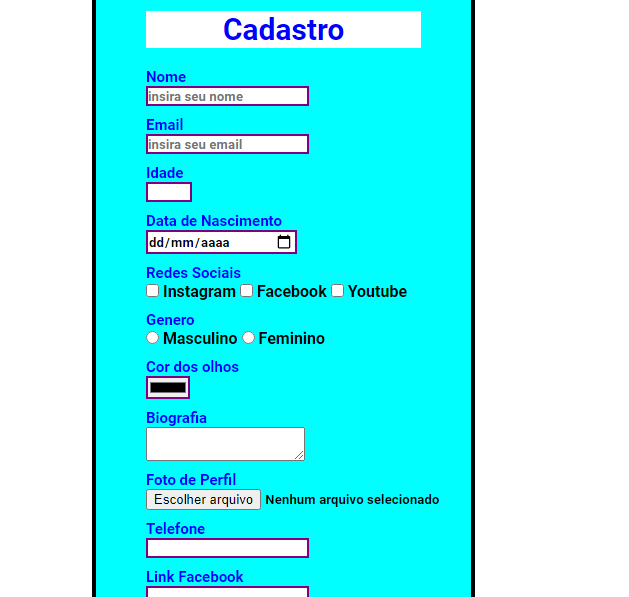
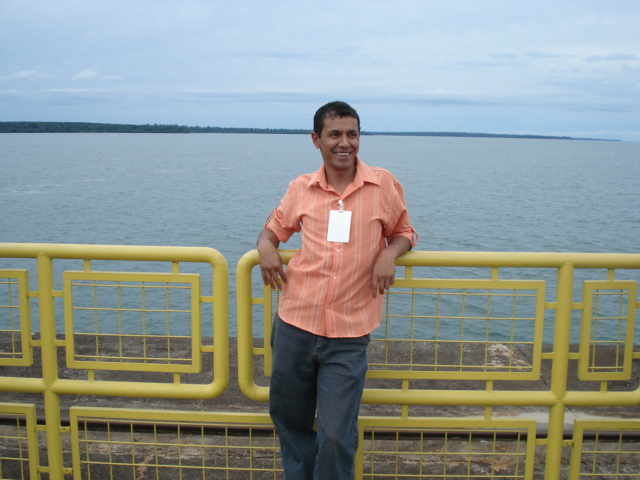

# Forms

  

 

> Este projeto teve por objetivo colocar em pratica novas habilidades no HTML e CSS.

### Ajustes e melhorias

O projeto ainda está em desenvolvimento e as próximas atualizações serão voltadas nas seguintes tarefas:

- [x] Adicionar novas melhorias de acordo com o aprendizado.

## 🤝 Colaboradores

Agradecemos às seguintes pessoas que contribuíram para este projeto:

<table>
  <tr>
    <td align="center">
      <a href="#">
         
        
          <b> Silvio Lopes</b>
        
      </a>
    </td>   
  </tr>
</table>

[⬆ Voltar ao topo](#Forms) 
